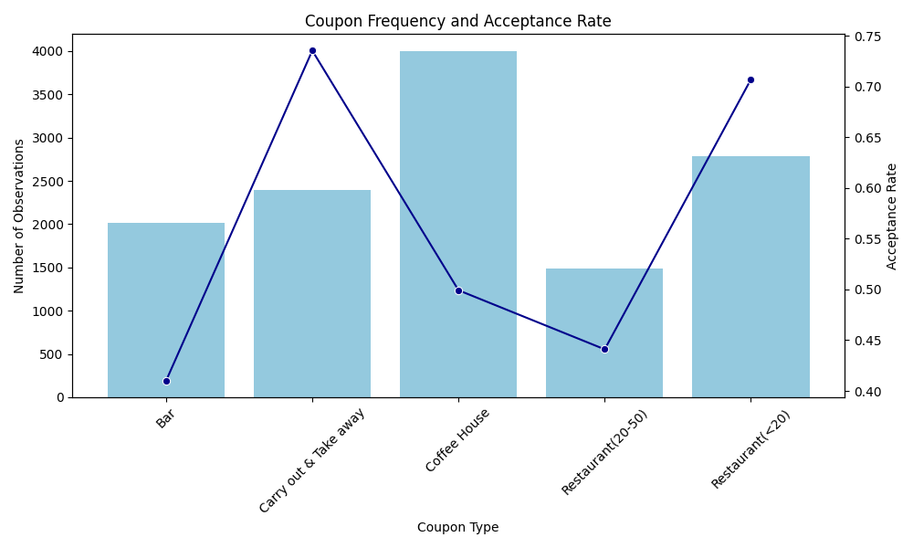

<h3 style="color:green;">URL (GitHub Repository):</h3> 

[Coupon Acceptance](https://github.com/RohitKBhatnagar/CouponAcceptance)

<h2 style="color:skyblue;">Project Overview</h2>

The project assignment involves analyzing survey data from Amazon Mechanical Turk to determine why drivers accept or reject various types of coupons. The dataset provided included scenarios like destination, weather, time, and passenger information, and the core metric was in the field 

-**coupon acceptance** acceptance (Y=1) versus rejection (Y=0).

<h3 style="color:orange;">Methodology</h3>

Following workflows were suggested as a standard data science approach using Python libraries:

- **Data Cleaning**: 
The process included handling missing values (e.g., dropping the car column, imputing others with mode), standardizing text data, removing duplicates, and treating outliers.

- **Statistical Summaries & Visualization**: 
Acceptance rates were calculated and visualized using pandas, matplotlib, and seaborn across different dimensions like coupon type, weather, time, and passenger type.

<h3 style="color:orange;">Key Findings and Insights</h3>

- **Coupon Type Matters**: Coffee house and less expensive restaurant coupons had the highest acceptance rates, while bars and expensive restaurants had the lowest.
- **Contextual Influence**: Acceptance was higher in good weather, during the afternoon/evening, and when driving with friends or partners.
- **Demographic Predictors**: Younger customers (20-29), single individuals, and those with lower incomes were more likely to accept bar coupons.
- **Behavioral Overlap**: Drivers who frequented bars or cheap restaurants already were significantly more likely to accept related coupons, especially when their social context allowed (e.g., no kids in the car).

<h3 style="color:purple;">Results from dataset</h3>
<h4 style="color:pink;"> Coupon Acceptance Rates</h4>

| **Coupon Type**            | **Acceptance Rate** |
|-----------------------------|----------------------|
| Bar                        | 40.99% |
| Carry out & take away      | 73.38% |
| Coffee house               | 49.86% |
| Restaurant (20–50)         | 44.15% |
| Restaurant (<20)           | 70.78% |

**Overall Proportion of Accepted Coupons:** **56.76%**

---

<h3 style="color:orange;">Bar Coupons study</h3>
Summary of the analysis focusing specifically on the bar coupons, highlighting the differences between those who accepted and rejected the offer.

**Bar Coupon Acceptance Analysis**

The analysis of bar coupons revealed that customer behavior and demographics significantly influence whether a driver accepts the offer. Overall, bar coupons had a lower acceptance rate compared to coffee house or inexpensive restaurant coupons.

**Key Differences Between Acceptors and Rejectors**
Drivers who accepted bar coupons generally shared several characteristics and contextual factors:
- **Frequency of Visits**: The most significant predictor was how often a person already visited bars. Frequent bar-goers (more than once a month or more than 3 times a month) were much more likely to accept the coupon than occasional visitors.
- **Age and Marital Status**: Acceptance rates were highest among younger age groups (especially 20-29 year olds) and single individuals. Acceptance steadily declined with age and among married individuals.
- **Social Context (Passengers)**: Drivers were more likely to accept a bar coupon if their passenger was a friend or partner, and acceptance dropped when a kid was in the car, suggesting social appropriateness heavily influences the decision.
- **Income and Occupation**: Lower-income students were a prime segment for acceptance. Certain occupations (outside of farming/fishing/forestry) also showed higher acceptance rates when combined with frequent bar visits.
- **Time of Day**: Afternoon and evening scenarios showed higher acceptance rates than mornings.

<h3 style="color:purple;">Key Findings & Insights</h3>
The findings suggest that bar coupons are most appealing to a specific lifestyle segment: socially active, younger individuals whose current situation allows for a spontaneous stop at a bar (e.g., no child in the car).

<h3 style="color:purple;">Results from dataset</h3>
<h4 style="color:pink;"> Bar Coupon Acceptance by Marital Status</h4>

| **Marital Status**   | **Acceptance Rate (Y)** |
|-----------------------|--------------------------|
| Divorced             | 24.00% |
| Married partner      | 32.80% |
| Single               | 54.61% |
| Unmarried partner    | 39.95% |
| Widowed              | 33.33% |

**Quick Insights:**
- **Highest acceptance:** *Single* individuals (54.61%).  
- **Lowest acceptance:** *Divorced* individuals (24.00%).  
- *Married, widowed, and unmarried partners cluster around ~33–40%.*

<h4 style="color:pink;"> Bar Coupon Acceptance by Age Group</h4>

| **Age Group** | **Acceptance Rate (Y)** |
|---------------|--------------------------|
| <20           | N/A |
| 20–29         | 44.33% |
| 30–39         | 34.31% |
| 40–49         | 39.93% |
| 50–59         | N/A |
| 60+           | N/A |

**Quick Insights:**
- Acceptance is **highest among 20–29 year olds** (44.33%).  
- **Lowest acceptance** is in the 30–39 group (34.31%).  
- Middle‑aged groups (40–49) show moderate acceptance (~40%).  
- *Data is missing (NaN) for <20, 50–59, and 60+, which may indicate insufficient sample size or lack of interest in coupons*.

<h4 style="color:pink;"> Bar Coupon Acceptance by Income Slabs</h4>

| **Income Slab**       | **Acceptance Rate (Y)** |
|------------------------|--------------------------|
| $100,000 or more      | 47.57% |
| $12,500 – $24,999     | 41.67% |
| $25,000 – $37,499     | 44.97% |
| $37,500 – $49,999     | 34.83% |
| $50,000 – $62,499     | 41.22% |
| $62,500 – $74,999     | 35.38% |
| $75,000 – $87,499     | 37.75% |
| $87,500 – $99,999     | 31.21% |
| Less than $12,500     | 46.06% |

**Quick Insights:**
- **Highest acceptance:** *$100,000+* (47.57%) and *Less than $12,500* (46.06%).  
- **Lowest acceptance:** *$87,500–$99,999* (31.21%).  
- Middle‑income brackets ($37,500–$74,999) show relatively lower acceptance (~34–41%).  
- Suggests a **U‑shaped trend**: both lower and higher income groups are more likely to accept bar coupons compared to mid‑income ranges.

<h4 style="color:pink;"> Bar Coupon Acceptance by by Occupation</h4>

| **Occupation**                               | **Acceptance Rate (Y)** |
|----------------------------------------------|--------------------------|
| Architecture & Engineering                   | 66.67% |
| Arts, Design, Entertainment, Sports & Media  | 33.00% |
| Building & Grounds Cleaning & Maintenance    | 28.57% |
| Business & Financial                         | 46.07% |
| Community & Social Services                  | 29.55% |
| Computer & Mathematical                      | 37.55% |
| Construction & Extraction                    | 54.17% |
| Education, Training & Library                | 28.57% |
| Farming, Fishing & Forestry                  | 44.44% |
| Food Preparation & Serving Related           | 47.92% |
| Healthcare Practitioners & Technical         | 43.90% |
| Healthcare Support                           | 65.91% |
| Installation, Maintenance & Repair           | 44.44% |
| Legal                                        | 35.29% |
| Life, Physical, Social Science               | 62.50% |
| Management                                   | 54.78% |
| Office & Administrative Support              | 50.48% |
| Personal Care & Service                      | 37.04% |
| Production Occupations                       | 66.67% |
| Protective Service                           | 48.15% |
| Retired                                      | 24.00% |
| Sales & Related                              | 44.94% |
| Student                                      | 47.81% |
| Transportation & Material Moving             | 25.71% |
| Unemployed                                   | 30.23% |

**Quick Insights:**
- **Highest acceptance:** *Architecture & Engineering* and *Production Occupations* (both 66.67%), followed closely by *Healthcare Support* (65.91%) and *Life/Physical/Social Science* (62.50%).  
- **Lowest acceptance:** *Retired* (24.00%), *Transportation & Material Moving* (25.71%), and *Building & Grounds Cleaning* (28.57%).  
- Mid‑range acceptance (~40–50%) is common across business, food service, healthcare practitioners, and sales.  
- Suggests that **technical and production roles** are more receptive to coupons, while **retired/unemployed groups** are less likely to accept them.  

---

<h3 style="color:purple;">Results from dataset</h3>
<h4 style="color:pink;"> Coffee House Coupon Acceptance by Age Groups</h4>

| **Age Group** | **Acceptance Rate (Y)** |
|---------------|--------------------------|
| <20           | N/A |
| 20–29         | 50.87% |
| 30–39         | 47.16% |
| 40–49         | 50.46% |
| 50–59         | N/A |
| 60+           | N/A |

**Quick Insights:**
- **Strongest acceptance:** *20–29* (50.87%) and *40–49* (50.46%), showing similar levels of coupon usage.  
- **Moderate acceptance:** *30–39* (47.16%).  
- **Data gaps:** No recorded acceptance for <20, 50–59, and 60+, likely due to insufficient sample size.  
- Overall, coffee house coupons seem most appealing to **young adults and mid‑career professionals**.

<h4 style="color:pink;"> Coffee House Coupon Acceptance by Marital Status</h4>

| **Marital Status**   | **Acceptance Rate (Y)** |
|-----------------------|--------------------------|
| Divorced             | 52.32% |
| Married partner      | 49.15% |
| Single               | 51.61% |
| Unmarried partner    | 47.84% |
| Widowed              | 35.14% |

**Quick Insights:**
- **Highest acceptance:** *Divorced* (52.32%) and *Single* (51.61%).  
- **Lowest acceptance:** *Widowed* (35.14%).  
- Married and unmarried partners hover around ~48–49%, showing moderate acceptance.  
- Overall, **non‑widowed groups are fairly consistent**, clustering around ~48–52%.  

<h4 style="color:pink;"> Coffee House Coupon Acceptance by Income Slabs</h4>

| **Income Slab**       | **Acceptance Rate (Y)** |
|------------------------|--------------------------|
| $100,000 or more      | 49.15% |
| $12,500 – $24,999     | 54.04% |
| $25,000 – $37,499     | 47.34% |
| $37,500 – $49,999     | 54.24% |
| $50,000 – $62,499     | 50.37% |
| $62,500 – $74,999     | 43.64% |
| $75,000 – $87,499     | 29.66% |
| $87,500 – $99,999     | 55.43% |
| Less than $12,500      | 55.19% |

**Quick Insights:**
- **Highest acceptance:** *$87,500–$99,999* (55.43%) and *Less than $12,500* (55.19%).
- **Lowest acceptance:** *$75,000–$87,499* (29.66%). *A clear outlier* 
- Most other brackets hover around ~47–54%, showing relatively balanced acceptance.  
- Suggests that **upper‑middle income groups** ($37,500–$99,999) are more receptive, while the $75k–$87k bracket is an outlier with notably lower acceptance.

<h4 style="color:pink;"> Coffee House Coupon Acceptance by Occupation</h4>

| **Occupation**                               | **Acceptance Rate (Y)** |
|----------------------------------------------|--------------------------|
| Architecture & Engineering                   | 55.56% |
| Arts, Design, Entertainment, Sports & Media  | 50.72% |
| Building & Grounds Cleaning & Maintenance    | 72.73% |
| Business & Financial                         | 47.95% |
| Community & Social Services                  | 35.14% |
| Computer & Mathematical                      | 50.00% |
| Construction & Extraction                    | 47.83% |
| Education, Training & Library                | 43.58% |
| Farming, Fishing & Forestry                  | 54.55% |
| Food Preparation & Serving Related           | 44.58% |
| Healthcare Practitioners & Technical         | 74.32% |
| Healthcare Support                           | 61.54% |
| Installation, Maintenance & Repair           | 56.82% |
| Legal                                        | 37.68% |
| Life, Physical, Social Science               | 47.54% |
| Management                                   | 45.24% |
| Office & Administrative Support              | 43.15% |
| Personal Care & Service                      | 50.00% |
| Production Occupations                       | 35.71% |
| Protective Service                           | 44.83% |
| Retired                                      | 40.24% |
| Sales & Related                              | 39.15% |
| Student                                      | 62.53% |
| Transportation & Material Moving             | 61.84% |
| Unemployed                                   | 54.21% |

**Quick Insights:**
- **Highest acceptance:** *Healthcare Practitioners & Technical* (74.32%) and *Building & Grounds Cleaning & Maintenance* (72.73%).  
- **Strong acceptance:** *Students* (62.53%), *Transportation & Material Moving* (61.84%), and *Healthcare Support* (61.54%).  
- **Lowest acceptance:** *Community & Social Services* (35.14%) and *Production Occupations* (35.71%).  
- Most occupations cluster between **45–55%**, showing moderate acceptance.  

---

<h3 style="color:orange;">Coffee House Coupons study</h3>
Summary of the analysis focusing on the coffee house and less expensive restaurant coupons.

**Coffee House & Less Expensive Restaurant Coupon Analysis**
These two categories had the highest acceptance rates overall, suggesting they appeal to a broad range of customers for everyday use.

<h3 style="color:purple;">Key Findings & Insights</h3>

- **High Appeal**: Coupons for coffee houses and restaurants under $20 were the most popular among all five types offered.

- **Convenience & Low Cost**: Customers are generally more likely to use coupons for everyday, low-cost purchases that can be used "right away" or "later, before the coupon expires".

- **Weather Influence**: Like other coupons, acceptance rates were higher in good weather.

**Insights**
These coupons resonate with customers looking for convenience and value in their daily routines. They require less commitment (financially and socially) than a bar or an expensive restaurant, making the decision to accept them much easier.

---

<h3 style="color:orange;">General inference on various Coupon Types</h3>

<h4 style="color:pink;"> Coupon Type Distribution</h4>

| **Coupon Type**           | **Count** |
|----------------------------|-----------|
| Coffee house              | 3,989 |
| Restaurant (<20)          | 2,779 |
| Carry out & take away     | 2,344 |
| Bar                       | 2,010 |
| Restaurant (20–50)        | 1,488 |

---

**Quick Insights:**
- **Most frequent coupon type:** *Coffee house* (3,989).  
- **Least frequent coupon type:** *Restaurant (20–50)* (1,488).  
- Restaurants overall (both <20 and 20–50) together account for **4,267 coupons**, slightly more than coffee house alone.  
- Carry out & take away and bar coupons are mid‑range in frequency.  

<h4 style="color:pink;"> Coupon Counts and Acceptance Rates</h4>

| **Coupon Type**           | **Count** | **Acceptance Rate** |
|----------------------------|-----------|----------------------|
| Bar                       | 2,010     | 40.99% |
| Carry out & take away     | 2,344     | 73.38% |
| Coffee house              | 3,989     | 49.86% |
| Restaurant (20–50)        | 1,488     | 44.15% |
| Restaurant (<20)          | 2,779     | 70.78% |

**Quick Insights:**
- **Most popular coupon type by count:** *Coffee house* (3,989).  
- **Highest acceptance rate:** *Carry out & take away* (73.38%), closely followed by *Restaurant (<20)* (70.78%).  
- **Lowest acceptance rate:** *Bar* (40.99%).  
- Restaurants overall (both <20 and 20–50) together account for **4,267 coupons**, with strong acceptance in the <20 category.  

<!--  -->
